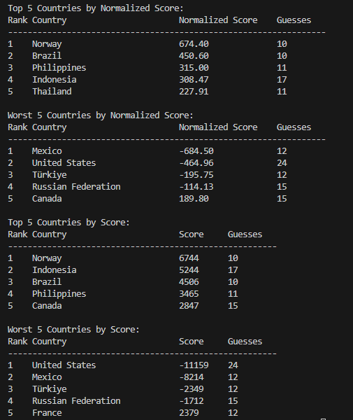

# GeoGuessr Top Countries Stats

This project provides a script to analyze your GeoGuessr gameplay statistics, focusing on the top-performing and least-performing countries based on your recent duels.



## Acknowledgments

A significant portion of the API communication code is adapted from the following repositories (thank you!):  
- [GeoGuessr-API by EvickaStudio](https://github.com/EvickaStudio/GeoGuessr-API/blob/main/main.py)  
- [GGDuelsFetcher by kevinzhao14](https://github.com/kevinzhao14/GGDuelsFetcher)

## Getting Started

To use this script, ensure you have Python 3 installed on your computer. You can download it from the official Python website: [https://www.python.org/downloads/](https://www.python.org/downloads/).

Additionally, you'll need to install the following Python libraries:  
- `requests`  
- `pycountry`  

Install them by running the following command in your terminal:  
```bash
pip install requests pycountry
```

### Authentication

To access most API endpoints, you need to provide a `_ncfa` cookie. Follow these steps to extract the `_ncfa` cookie from your browser:

1. Open the developer tools in your browser.
2. Navigate to the "Network" tab.
3. Refresh the page to capture network traffic.
4. Look for a request to the `profiles` endpoint in the network traffic.
5. Click on the request to view its details.
6. Locate the `_ncfa` token in the request headers or cookies.
7. Copy the `_ncfa` token and paste it into the script where indicated.

You will also need your profil id which can be found at the bottom of your profil page.


### Usage

Run the script from the command line using the following command:  
```bash
python main.py
```

You can customize the script's behavior by modifying the following parameters in the code:  
- `num_duels`: Number of recent duels to fetch (default: 100).  
- `topN`: Number of top/worst countries to display (default: 3).  
- `min_guesses`: Minimum number of guesses required to include a country in the stats (default: 3).  

The script will fetch your most recent duels and display statistics about the countries you've encountered.

## License

This project is licensed under the MIT License. For more details, see the [LICENSE](LICENSE) file.
